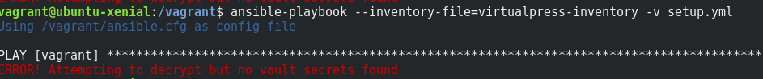

# BBL ANSIBLE-VAULT

Let's see how ansible-vault works.

## Definition of Ansible-Vault

“Vault” is a feature of ansible that allows keeping sensitive data such as passwords or keys in encrypted files, rather than as plaintext in your playbooks or roles. These vault files can then be distributed or placed in source control.

## Prerequisites

To make use of these files, you'll need to have the following prerequisites installed on your workstation:

* [VirtualBox](https://www.virtualbox.org/)
* [Vagrant](http://www.vagrantup.com/)


## What we gonna do ?

Together with the prerequisites listed above, the scripts contained herein will let you create a new VM with a simple `vagrant up` that install a running instance of Wordpress using Ansible-vault to encrypt passwords.

The purpose of this BBL is to see ansible-vault in action but once the box is provisioned, feel free to go to 192.168.50.50 in your browser to begin the famous WordPress 5-minute install ^^

## Getting Started

To begin, create an empty directory and clone the files in this repository into it.

Then create a `group_vars` directory and a `group_vars/vagrant` sub-directory.
Cd in the vagrant subdirectory and create a `vars.yml` and a `vault.yml` files:

```
$ vim vars.yml
 ---
 wp_debug_value: true
# save and exit vim...


$ ansible-vault create vault.yml
# you'll have to choose a password
 ---
 
 mysql_root_password: my_salted_passwd_for_vagrant_env
 
 wp_db_user_name: my_beautiful_name
 wp_db_user_password: my_salted_mysql_user_db_pass

#save and exit vim...
```

After providing a password, the tool will launch whatever editor you have defined with $EDITOR, and defaults to vi.
Once you are done with the editor session, the file will be saved as encrypted data. The default cipher is [AES](https://en.wikipedia.org/wiki/Advanced_Encryption_Standard).


Cd into the root directory and run the command `vagrant up`, and your VM should bootstrap itself into existence, ready to work with.

Then ssh to your VM using `vagrant ssh` and run the following command :

```
$ cd /vagrant
$ ansible-playbook --inventory-file=virtualpress-inventory -v setup.yml
```
Oups ! Ansible cannot decipher the encrypted file... Which is completely normal since we have not provided the password. 



Let's add the `--ask-vault-pass` cli option to the ansible-playbook command:

```
$ ansible-playbook --inventory-file=virtualpress-inventory -v --ask-vault-pass setup.yml
# enter your vault password
```

Ta da! The provisioning can begin.

## Ansible Vault in a CD context

Since Ansible 2.4, the recommended way to provide a vault password from the cli is to use the `--vault-id` cli option.

For example, to use a password store in the text file `/path/to/my/vault-password-file`:

```
$ ansible-playbook --vault-id /path/to/my/vault-password-file site.yml
```

Prior to Ansible 2.4
```
$ ansible-playbook --vault-password-file dev-password site.yml
```

## Encrypting Unencrypted Files

```
$ ansible-vault encrypt externals_vars_qualif.yml
```

Just as simple...

## Resources

* Ansible vault : https://docs.ansible.com/ansible/2.4/vault.html
* Using Vagrant and Ansible : http://docs.ansible.com/ansible/latest/guide_vagrant.html
